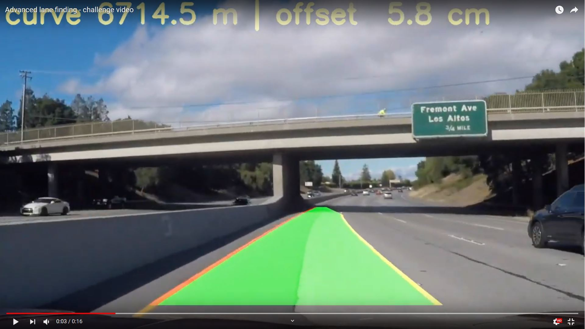
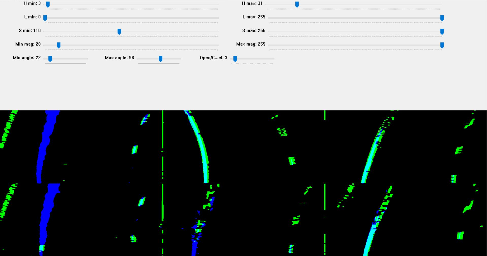
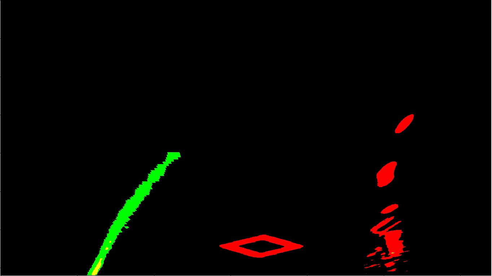
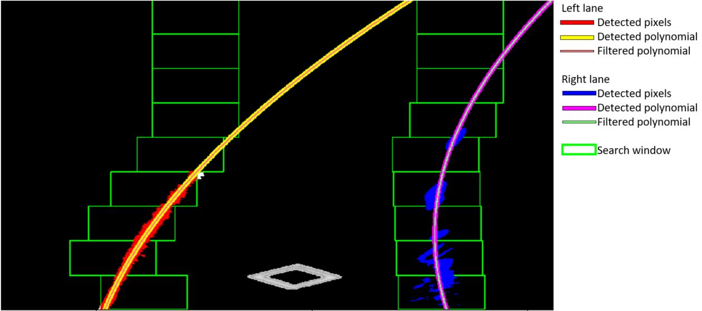

## Advanced Lane Finding project

[](https://www.youtube.com/watch?v=dhsexUZopo0)

The goals/steps of this project are the following:

* Compute the camera calibration matrix and distortion coefficients given a set of chessboard images.
* Apply a distortion correction to raw images.
* Use color transforms, gradients, etc., to create a thresholded binary image.
* Apply a perspective transform to rectify binary image ("birds-eye view").
* Detect lane pixels and fit to find the lane boundary.
* Determine the curvature of the lane and vehicle position with respect to the center.
* Warp the detected lane boundaries back onto the original image.
* Output visual display of the lane boundaries and numerical estimation of lane curvature and vehicle position.

[figure1]: ./writeup_images/distored_undistored.jpg "Detected corners"
[figure2]: ./writeup_images/calib_results.jpg    "Distored and Undistored image"
[figure3]: ./distored_undistored_road.jpg    "Normal and undistored road image"
[figure4]: ./writeup_images/birds_eye2.jpg    "Normal and bird's eye view"
[figure5]: ./writeup_images/birds_eye_filtered.jpg    "Sobel edge detection and HLS color filters"
[figure6]: ./writeup_images/yellow_white_lane.jpg    "Adaptive threshold results"
[figure7]: ./writeup_images/polynomial_subtitle.jpg    "Deteced curves"
[figure8]: ./video_images/vlcsnap-00007.jpg            "Example frame from the video stream"
[video1]: ./test_videos_output/project_video.mp4    "Project video"
[video2]: ./test_videos_output/challenge_video.mp4    "Challenge video"

| Folder name        | Comment                                |
| ------------------ | -------------------------------------- |
| camera_cal         | Images for the camera calibration      |
| src                | Here is the source code                |
| test_images        | Images, which I used for testing       |
| test_videos_output | Processed videos                       |
| video_images       | Snapshots from the video               |
| writeup_images     | Images that are used for this document |

### Camera Calibration

#### 1. Calculating camera matrix and distortion coefficients to eliminate camera distortion. 

The camera calibration process is located in ```cameraCailbration.py``` file. Calibration parameters which are the **camera matrix** and **distortion coefficients** are determined with ```get_calibration_params()```  function, and generate undistorted image with ```get_undistorted_image()``` function. I read the calibration pictures with glob library. With a for loop, I processed all the images. These were process steps:

1. Convert current image to grayscale
2. Find corners with ```findChessboardCorners()``` function
3. If corners were found, I appended the corners and image points to my list

This is the results.


*Figure 1. Chessboard corner finding results*

After the object and image points were determined, I calculated **camera matrix** and **distortion coefficients** with ```calibrateCamera()``` function, and generate the undistorted the image.

Final results:


*Figure 2. Normal and undistorted image*

### Pipeline (single images)

The image process pipeline is in implemented in ```processed_image()``` function, which is located in ```main.py``` source file.

#### 1. Generate undistorted image

To eliminate distortion, I used the  **camera matrix** and **distortion coefficients**, which are calculated with camera calibration.


*Figure 3: Normal and Undistorted road image*

#### 2. Get bird's eye view

The perspective correction method is located in ```geometries.py``` file. I generated bird's eye view with the ``get_perspective()    `` function. In the road image, I selected the four corners with the pyplot's interactive menu. 

```python
top_left = (585, 453)
top_right = (697, 453)
bottom_left = (270, 668)
bottom_right = (1060, 668) 
```

On the bird's eye view, I used 150-pixel padding on the horizontal axis. 

```python
top_left = (vert_padding, 0)
top_right = (image_size[0] - vert_padding, 0)
bottom_left = (vert_padding, image_size[1])
bottom_right = (image_size[0] - vert_padding, image_size[1])
dst = np.float32([[top_left], [top_right], [bottom_left], [bottom_right]])
```

This resulted in the following source and destination points:

|  Source   | Destination |
| :-------: | :---------: |
| 585, 453  |   150, 0    |
| 697, 453  |   570, 0    |
| 270, 668  |  150, 1280  |
| 1060, 668 |  570, 1280  |


*Figure 4. Region of interest in normal perspective, and bird's eye view*

#### 3. Image filtering

For the first step, I blurred the undistorted image with a 5x5 kernel. 

For a first attempt, I filtered the image with the combination of Sobel edge detection and HLS color filtering. I used absolute gradient magnitude and gradient direction for Sobel. I combined the 6 test image into one, and then I created a window, where I manually adjusted the threshold limits. After the limit tuning, I add the two filters output, the results are *Figure 4* . The green color is the output of the Sobel filter and blue is for HLS filter. These functions are located ```adjust_filter_params.py``` file. To reduce noise I used open morphological operator to reduce noise, and close connect remained surface.



*Figure 5. Results of Sobel and HLS filtering for the combined test pictures filter*

These methods only worked on project video. For a more robust solution, I used adaptive color thresholds, which are located in ```combiningThresholds.py```. 

##### 3.1. Yellow lane detection

The yellow lane detection is implemented in ```filter_yellow_lane()``` function.  Firstly, I converted the image into HLS color space, and then I applied and alpha beta correction to be sure, that the channel range ([0, 255]) is fully used, Than I removed the pixels, which has low light and  saturation, and sum the result, with this code:

```
s_ch2[(l_ch2 < l_ch2.mean()) | (s_ch2 < s_ch2.mean())] = 0
l_ch2[(l_ch2 < l_ch2.mean()) | (s_ch2 < s_ch2.mean())] = 0

ch_add = s_ch2 + l_ch2
```

##### 3.2. White lane detection

The white lane detection is implemented in ```filter_white_lane()``` function. I used the R and the G channel to the RGB color space to detect the white color.  To eliminate that dark surface disturb, in this case, I used ```get_mean_bigger_than()``` function to calculate the mean. The function calculates the mean of the numbers, which are bigger than the given limit.

```
white_lane = np.copy(input_image)
r_ch = white_lane[:, :, 0]
r_ch = alpha_beta_auto_correction(r_ch)
threshold = get_mean_bigger_than(r_ch, 75)
r_ch[r_ch * 0.8 < threshold] = 0

g_ch = white_lane[:, :, 1]
g_ch = alpha_beta_auto_correction(g_ch)
threshold = get_mean_bigger_than(g_ch, 75)
g_ch[(g_ch * 0.9 < threshold)] = 0

white_lane[:, :, 0] = r_ch
white_lane[:, :, 1] = g_ch
white_lane[:, :, 2] = 0
```

**Filter result:**



*Figure 6. Results of yellow and white lane filters. Green is the* ```filter_yellow_lane()``` *results, red is the* ```filter_white_lane()```

#### 4. Identifying lane-line pixels and fit their positions with a polynomial

The polynomial fitting and position handled in ```draw_lanes()``` function, which is located in ```geometries.py ```

file.  Main steps are:

* **Detect pixels which belong to the two curve**. This step is implemented in ```search_around_poly()``` function. The method uses the curves which were found in the previous frame. For the hyperparameters I used ```margin = 100``` and ```minpinx = 20```. If the previous curves don't exist or the search was unsuccessful, it returns the ```find_lane_pixels()``` function results. The ```find_lane_pixels()``` uses histograms with windows to find pixels, which belongs to the polynomials.
* **Polynomial fitting to found pixels** is implemented in ```fit_poly_on_found_pixels()```. This function handles that case also if the curve not found.
* **Filtering the Fitted polynomial** is done by ```Line``` class which is in the ```line.py```. The class uses a FIFO memory for average filtering. When I add new value with the  ```append()``` function of ```Line``` class, firstly I check with Least square error to determine, how much it differs from the previous curve. If the error is too high, the current value is ignored. I calculate the filtered polynomial with the mean of the FIFO memory.



*Figure 7. Detected curves*

#### 5. Calculating the radius of curvature of the lane and the position of the vehicle with respect to the center.

The curvature calculation is done by ```get_radius_in_meter()``` function in the Line class. Every time, when I call ```append()``` function to add new value to the class, I recalculate the radius. The current radius is the mean of the radius FIFO memory.

#### 6. An example image of result plotted back down onto the road such that the lane area is identified clearly.


*Figure 8. Lane detection results*

---

### Pipeline (video)

#### 1. [project_video](https://www.youtube.com/watch?v=dhsexUZopo0)

#### 2. [challenge_video](https://www.youtube.com/watch?v=dhsexUZopo0) 

---

### Discussion

* To detect lane lines each time at every light and road condition is a hard task. Light changes make it harder the color filtering and road fissures the edge detection.
* For robust algorithm, light thresholds have to be adaptive.
* In a storm, or with a dirt road, the algorithm couldn't work properly.
* We could use convolutional neural networks (CNN), with multiple cameras, or Kalman filter to get the more robust result.
* The filter will fail, if the FIFO memory is filled with corrupted data.
* White lane detection will fail if the road sides are too bright
