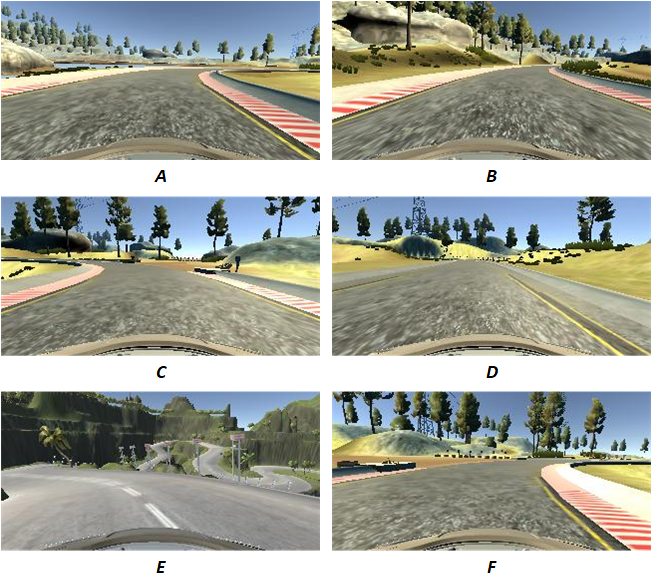
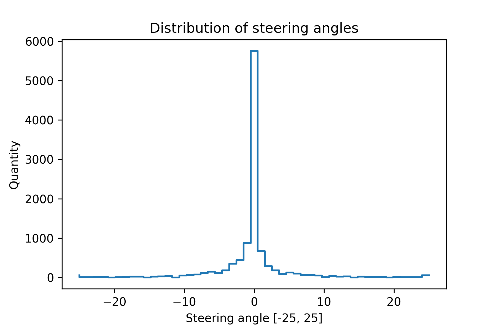
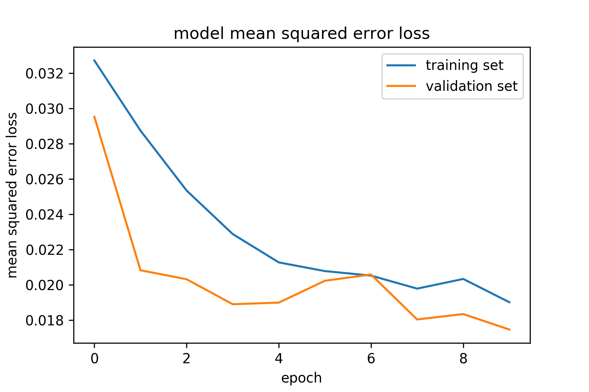
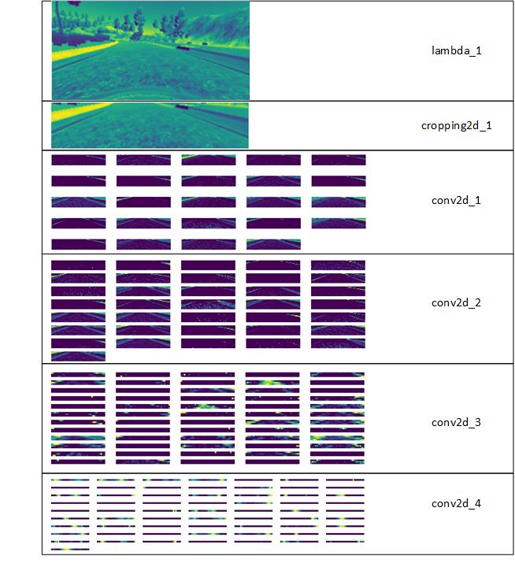

# Behavioral Cloning Project

[](http://www.udacity.com/drive)

Overview
---
The goals / steps of this project are the following:
* Use the simulator to collect data of good driving behavior
* Build, a convolution neural network in Keras that predicts steering angles from images
* Train and validate the model with a training and validation set
* Test that the model successfully drives around track one without leaving the road
* Summarize the results with a written report


[//]: # "Figure References"

[Figure 1]: ./writeup_images/youtube_video.jpg "Cover photo"
[Figure 2]: ./writeup_images/normal_preprocessed_image.png "Original and preprocessed images]"
[Figure 3]: ./writeup_images/model_arch.png "CNN architecture"
[Figure 4]: ./writeup_images/training_images.png "Training images"
[Figure 5]: ./writeup_images/steering_distribution.png "Steering distribution"
[Figure 6]: ./writeup_images/training_curve.png "Training results"
[Figure 7]: ./writeup_images/conv_layers.png "Layer activations"


[](https://www.youtube.com/watch?v=pN_6YbeSVic)

*Figure1: Simulator in autonomous mode*

#### 1. Image preprocessing

Proper image preprocessing is a vital step for a good result. Based on a [NVIDIA](https://devblogs.nvidia.com/deep-learning-self-driving-cars/) group paper, I converted the RGB images to YUV color space. The YUV color space more similar to human vision than RGB [[1]](https://annals-csis.org/Volume_3/pliks/206.pdf). To reduce noise, I used 3x3 Gaussian filter, on the processed image. The input and the output image resolution was 320x160.

The cropping and the normalization was done in ```lambda_1``` layer.


*Figure 2: Original and preprocessed image*

### Model Architecture and Training Strategy

#### 2. Solution Design Approach

My first step was to use a convolution neural network model similar to the [NVIDIA CNN model](https://devblogs.nvidia.com/deep-learning-self-driving-cars/).  I thought this model might be appropriate because, the with this network, researcher team controlled a real self-driving car. 

In order to gauge how well the model was working, I split my image and steering angle data into a training and validation set. I found that my first model had a low mean squared error on the training set but a high mean squared error on the validation set. This implied that the model was overfitting. 

To avoid overfitting:

* I added dropout layers after ```flatten_1, dense_1, and dense_2 ``` layers, 

* reduced the learning rate,

* increased the train and validation set.

At every dense and flatten layer I used RELU activation functions.

The final step was to run the simulator to see how well the car was driving around track one. There were a few spots where the vehicle fell off the track. To improve the driving behavior in these cases, I captured again these spots.

At the end of the process, the vehicle is able to drive autonomously around the track without leaving the road.

#### 2. Final Model Architecture

The final model architecture (```Behavioral_cloning_CNN.ipynb```) consisted of a convolution neural network with the following layers and layer sizes:

```python
Layer (type)                 Output Shape              Param #   
=================================================================
lambda_1 (Lambda)            (None, 160, 320, 3)       0         
_________________________________________________________________
cropping2d_1 (Cropping2D)    (None, 65, 320, 3)        0         
_________________________________________________________________
conv2d_1 (Conv2D)            (None, 31, 158, 24)       1824      
_________________________________________________________________
conv2d_2 (Conv2D)            (None, 14, 77, 36)        21636     
_________________________________________________________________
conv2d_3 (Conv2D)            (None, 5, 37, 48)         43248     
_________________________________________________________________
conv2d_4 (Conv2D)            (None, 3, 35, 64)         27712     
_________________________________________________________________
conv2d_5 (Conv2D)            (None, 1, 33, 64)         36928     
_________________________________________________________________
flatten_1 (Flatten)          (None, 2112)              0         
_________________________________________________________________
dropout_1 (Dropout)          (None, 2112)              0         
_________________________________________________________________
dense_1 (Dense)              (None, 100)               211300    
_________________________________________________________________
dropout_2 (Dropout)          (None, 100)               0         
_________________________________________________________________
dense_2 (Dense)              (None, 50)                5050      
_________________________________________________________________
dropout_3 (Dropout)          (None, 50)                0         
_________________________________________________________________
dense_3 (Dense)              (None, 10)                510       
_________________________________________________________________
dense_4 (Dense)              (None, 1)                 11        
=================================================================
Total params: 348,219
Trainable params: 348,219
Non-trainable params: 0
```


Here is a visualization of the architecture:


*Figure 3: NVIDIA CNN architecture*

#### 3. Creation of the Training Set & Training Process

Data capturing for training process:

* 3 laps clockwise center lane driving, (***A***)
* 3 lap counter clockwise center lane driving (***B***)
* Difficult bends were taken additionally with center (***C***), outer **(D)** and inner lane driving **(F)**
* Some images were captured from Jungle track **(E)**



*Figure 4: Capturing training images*

After the collection process, I had 10209 number of data points. I tried to increase the number of images with random flip augmentation with negative steer angle, but the results became worse.



*Figure 5: Recorded steering angle distribution*

I finally randomly shuffled the data set and put 20% of the data into a validation set. 

I used this training data for training the model. The validation set helped determine if the model was over or under fitting. The ideal number of epochs was 10. I used an Adam optimizer with these hyperparameters:

```
learning_rate = 0.3e-3
batch_size = 32
epochs = 10
```

### Training result:



*Figure 6: Training and validation losses during the training*

### Layer activations:



*Figure 6: Layer activations for multiple layers*